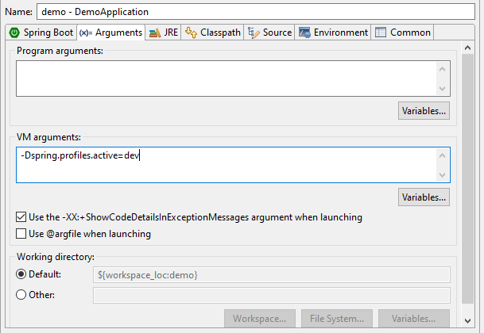

# Demo simple "microservice"

Simple Spring boot service run as microservice.

## Description

This simple project just show simple CRUD services with little config to show up how service works.

## Getting Started

### Prerequisites

* Windows OS or Linux distros
* Docker
* Docker compose
* Java 11
* Maven

### Installing

#### Run in dev environment

* Start the database up

  ```sh
  docker-compose up -d db
  ```

* Start services
  
  ```sh
  mvn clean install -DskipTests
  java -jar target/demo-0.0.1-SNAPSHOT.jar -Dspring.profiles.active=dev
  ```

* or run on your favourite IDEs
  with VM arguments:
  `-Dspring.profiles.active=dev`
  Example in eclipse:
  

#### Run in prod environment

* In production environment, you just run:
  
  ```sh
    mvn clean install -DskipTests
    docker-compose up -d
  ```

#### Any modifications needed to be made to files/folders

Let's see some configurations in this project in the **docker-compose.yml** file:

* **db service**: Informations that config the progres db with basic information of authentications, and mounted from docker container to host.

* **demo service**: This our backend service runs depend on postgres db service (or another existing postgres db) in production and we must fill up these informations:

  ```yml
    - POSTGRES_HOST=db # db service name in docker-compose.yml file or ip/hostname of existing db
    - POSTGRES_PORT=5432 # opening port of database
    - POSTGRES_DB=demo #database name used by this project
    - POSTGRES_USER=postgres # username for authenticating
    - POSTGRES_PASSWORD=postgres # password for authenticating
    - ACTIVE_PROFILE=prod # specific application profile if have multiple profiles for multiple environments 
  ```

## Authors

[@tuanvayn](https://github.com/tuanvayn)

## Version History

* 0.1
  * Initial Release
